# Judgement — CTO / Chief Architect Review and Production Roadmap

> Saved for future review. Originally drafted 2026-08-03.
> Related living docs: [docs/Architecture.md](docs/Architecture.md), [docs/SECURITY.md](docs/SECURITY.md), [docs/runbooks/](docs/runbooks/).

## Tracking checklist

- [ ] Phase A: hash tokens, remove WS `?token=`, lock `/metrics`, fail-closed CORS/DB
- [ ] Phase A: `/readyz` probes, backup restore drill, minimal alerts, CSP + session resume
- [x] Phase A: Privacy/Terms, RSVP+mic consent default off, retention note
- [ ] Phase A: clippy/fmt CI, GameController reconnect tests, lobby smoke
- [ ] Phase B: structured logs, Sentry, go_router, a11y, E2E staging, PII lifecycle
- [ ] Phase C: single-box SLA or ownership leases, SLO dashboards, modularize hot files

---

## Executive verdict

**What this is today:** A well-architected, guest-first multiplayer Judgement (Oh Hell) product — Rust authoritative engine + Flutter Web, Fly API + Firebase Hosting — strong enough for **private party nights** (roughly comfort ~20–30 tables, hard gates at 35 games / 200 WS).

**What it is not yet:** A **production-grade social platform** with contractual uptime, multi-tenant accounts, wired on-call, or legal/compliance surface.

**Rough score vs north-star “production-grade social card game”:** **~58%** (range 55–65%). Closing the gaps below can reach **~70%** (credible public soft-launch) then **~85%** (durable social product).

```mermaid
flowchart LR
  subgraph today [Today ~58pct]
    Engine[Authoritative engine]
    Actor[Actor-per-game CP]
    Capacity[Honest capacity gates]
    Docs[ADRs and runbooks]
  end
  subgraph softLaunch [Soft-launch ~70pct]
    Auth[Token storage and transport]
    Legal[Privacy Terms consent]
    Obs[Alerts and /readyz]
    Backup[Restore drill]
  end
  subgraph durable [Durable ~85pct]
    HA[Ownership leases or explicit single-box SLA]
    Acc[Accounts moderation]
    SLO[Dashboards error budgets]
    PII[Event PII lifecycle]
  end
  today --> softLaunch --> durable
```

---

## What I like (keep doubling down)

1. **Correctness architecture** — Domain/engine crates never own HTTP; clients mirror `PlayerGameView`; legality is server-side. This is the right model for a card game and rare in indie builds.
2. **Persist-before-broadcast (CP tables)** — Documented CAP stance; rollback on persist failure; action idempotency + `expected_state_version`. Players do not see “ghost accepts.”
3. **Capacity honesty** — Product busy/full gates, emergency caps, k6 ladder in CI/nightly, estimation docs that refuse to pretend load numbers are SLOs. Prefer this over silent overload.
4. **Presence / reconnect / bots** — Grace periods, token rotation on WS upgrade, bot takeover path — designed for flaky mobile networks.
5. **Ops literacy** — ADRs 0001–0005 match shipped behavior; deploy/incident/load runbooks; backup scripts; Phase 9 hardening kit (CORS allow-list, rate limits, seed gate, audio allow-lists).
6. **Web deploy maturity (recent)** — No PWA SW caching traps, stamped `build_id`, version bar on Create/Join, Firebase no-cache on SPA deep links (`/r/**`, `/e/**`).
7. **Social meetup v1 is real** — Schedule → RSVP → manage → open lobby (ADR 0005), not a fake landing CTA.
8. **Safari media realism** — Gesture/mic/autoplay handled as a first-class production problem, not ignored.

---

## What I dislike / friction (technical debt and product smell)

1. **Security hygiene lags architecture quality** — Plaintext session tokens in Postgres; WS `?token=` in query strings; manage tokens in URLs; public `/metrics`. Excellent engine, leaky identity edges.
2. **“Phase 9 Done” overclaims** — README/PLAN mark hardening done while dashboards, restore evidence, clippy/fmt/audit gates, and legal pages are incomplete.
3. **Single-machine blast radius** — One Fly API box; DB stall freezes that table (by design). Fine if marketed honestly; dangerous if sold as “always-on social.”
4. **Observability without ownership** — Rich Prometheus counters, empty on-call / status / alert wiring. Metrics without paging is theater.
5. **Compliance gap vs PII** — RSVP collects mobile + soft consent default-on; mic/voice with no policy link or age notice; no privacy/terms pages.
6. **Frontend session cliff** — Refresh mid-game loses in-memory guest token; imperative navigation; thin widget/reconnect test coverage relative to `table_screen` / `game_controller` size.
7. **Concentration risk** — Large `actor.rs`, `routes.rs`, `table_screen.dart`, `game_controller.dart` — reviewability and regression cost will grow faster than features if not split.

---

## Production-grade assessment (pillars)

| Pillar | Score | Comment |
|--------|-------|---------|
| Correctness / fairness | ~85% | Engine authority, dedup, CP persist, bots |
| Architecture / docs | ~80% | ADRs + runbooks match code |
| Load / capacity realism | ~85% | Gates + k6 + honest estimation |
| CI/CD | ~70% | Solid CI/deploy; thin e2e; no clippy/audit |
| Client web UX | ~70% | Deep features; cache story; mobile audio pain addressed |
| Observability / incident | ~40% | Metrics yes; alerts/on-call/status no |
| Legal / privacy / consent | ~20% | PII + mic without policy surface |
| Multi-tenancy / accounts / abuse | ~10% | Guest-only by design |
| HA / multi-node | ~15% | Explicitly single-writer; scale deferred correctly |

**CTO framing for stakeholders:** Ship and market as a **well-engineered private-table / party-night product**. Do **not** market as a production-grade always-on social platform until soft-launch gates pass.

---

## DOs

- Keep **hard capacity gates** on; treat comfort band as the real product envelope.
- Fail **closed** in prod: require `DATABASE_URL` and `ALLOWED_ORIGINS` (refuse MemoryStore + permissive CORS).
- Confirm Fly Postgres **continuous backups** and run one **restore drill**; date-stamp it in the runbook.
- Point Fly checks at **`/readyz`** (liveness `/healthz` separate).
- Lock down **`/metrics`** (private network, basic auth, or scrape agent only).
- Move credentials off URLs; **hash** session tokens at rest.
- Ship **Privacy + Terms**; mic/RSVP **opt-in consent default off** with purpose + timestamp.
- Wire **minimum alerts**: `/readyz` down, `db_write_failures` rising, OOM/restarts, sustained `CAPACITY_FULL`.
- Fill incident contacts + a one-line status channel before inviting strangers at scale.
- Keep prod load tests **manual, tiny, gated** (`ALLOW_PROD_LOAD`); never schedule stress against Fly.
- Prefer **split large files** and add GameController/reconnect tests before the next feature binge.
- Keep AI/RAG **off the gameplay path** (current design is correct).

## DONTs

- Do **not** scale to 2+ API machines without **game ownership leases** + sticky routing (docs already forbid naive scale-out).
- Do **not** claim multi-tenant SaaS, contractual 99.9%, or “platform” positioning yet.
- Do **not** enable SMS/WhatsApp on stored mobiles without consent redesign + provider compliance.
- Do **not** reintroduce aggressive PWA/service-worker caching of the game shell.
- Do **not** await media unlock/mic on the critical join path without the mobile Safari settle pattern you already learned.
- Do **not** leave `/metrics` and permissive CORS on a public hostname while marketing growth.
- Do **not** mark Phase 9 externally complete until legal + restore + alerts exist.
- Do **not** treat RSVP mobiles as a growth list without a retention clock.

---

## Way forward — phased plan to close the gap

### Phase A — Soft-launch gate (target ~70%) — ~2–4 weeks

**Security & config**
- Hash guest session tokens in DB; migrate `guest_sessions`.
- WS auth via `Sec-WebSocket-Protocol` or short-lived connect ticket (no `?token=`).
- Manage-link tokens: one-time exchange or fragment; avoid durable secrets in share URLs/logs.
- AuthN/authZ for `/metrics`; fail-closed `ALLOWED_ORIGINS` + `DATABASE_URL`.

**Reliability ops**
- Fly probe → `/readyz`; document last backup restore.
- Minimal alert path (even email/Slack webhook from a tiny scraper).
- Client: session resume via short-TTL `sessionStorage`; CSP + frame protection on Firebase.

**Compliance MVP**
- Privacy Policy + Terms pages linked from landing, RSVP, and first mic prompt.
- RSVP contact consent default **off**; store consent timestamp; retention note (e.g. purge mobiles N days after event).

**Quality**
- CI: `clippy`, `fmt --check`; GameController unit tests for reconnect/reject; one lobby/capacity widget smoke.

### Phase B — Public growth readiness (target ~75–80%) — ~1–2 months

- Structured JSON logs + `game_id` / `session_id` correlation (no secrets).
- Sentry (or equivalent) on Flutter web + release = `build_id`.
- Declarative routing (`go_router`) for `/r/:code`, `/e/:slug`; mid-game refresh recovery.
- Table a11y pass (turn/live regions); nightly hosted E2E against staging.
- Rate-limiter GC; trust `Fly-Client-IP`; graceful drain on deploy.
- Event PII lifecycle: export/delete for hosts; GC scheduled-event rows.

### Phase C — Durable social product (target ~85%+) — ~1 quarter

- Explicit product decision: **single-box SLA** (documented) **or** multi-machine ownership leases — pick one, fund it.
- SLO dashboard + error budget (availability, persist p95, capacity reject rate).
- Accounts / stronger identity only if abuse or persistence requires it; moderation for voice/emotes/RSVP spam.
- i18n scaffolding if expanding beyond EN party groups.
- Modularize `actor.rs` / `routes.rs` / `table_screen.dart`; chaos (DB pause, reconnect storm).

---

## Suggested operating model (now)

| Role need | Minimum |
|-----------|---------|
| On-call | One named human + backup; phone for SEV-1 |
| Status | Single Slack/WhatsApp admin channel or simple status doc |
| Release | Web via `tool/build_web_release.sh`; API via Fly; never skip stamp |
| Capacity | Watch busy/full metrics weekly; raise gates only after k6 comfort evidence |
| Incident | Follow [docs/runbooks/incident.md](docs/runbooks/incident.md); fill `_TBD_` contacts this week |

---

## Bottom line

Judgement’s **core game systems and engineering judgment are ahead of most indie multiplayer projects**. The gap to “production level” is not “rewrite the engine” — it is **identity security, compliance, observability ownership, and honest product positioning**.

Execute **Phase A** before broad public growth marketing. Treat Phase B/C as the difference between a great party product and a durable social business.
