# Judgement — System Architecture

Last reviewed: 2026-07-31

This document describes the architecture of the Judgement (Oh Hell) multiplayer product: layered design, runtime flows, interfaces, communication, and data durability. It complements [`PLAN.md`](../PLAN.md), ADRs under [`docs/adr/`](adr/), and [`docs/RULES.md`](RULES.md).

**Core principle:** the client requests; the server decides. Flutter never owns legality, scores, turn order, or shuffle.

---

## 1. System context

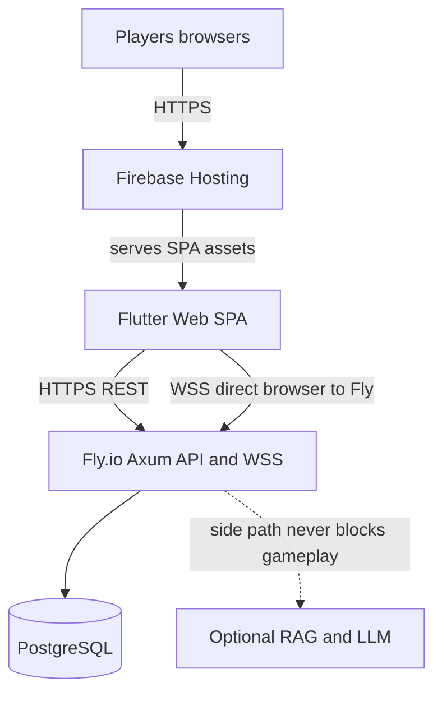

| Piece | Host | Notes |
|-------|------|--------|
| Flutter Web SPA | Firebase Hosting (`judgment-lws-260731`) | SPA rewrites for `/e/{slug}` and `/r/{CODE}` deep links |
| API + WebSocket | Fly.io (`judgment-api`) | Browser talks to Fly for WSS; Firebase does **not** proxy WS |
| Postgres | Fly Postgres / Neon / Supabase | Events + snapshots; migrations on boot |
| AI / RAG | Same API process | Optional; never mutates game state |

---

## 2. Layered design

### 2.1 Backend crate layers

Dependency direction is strictly inward: outer crates may depend on inner ones; the engine and domain never import Axum, sqlx, or Flutter.

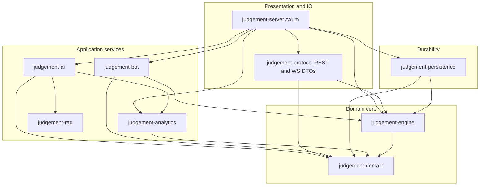

| Crate | Responsibility |
|-------|----------------|
| `judgement-domain` | Cards, IDs, rules config, scores, `GameError`, connection status |
| `judgement-engine` | Deterministic state machine: deal, bid, play, score, projections |
| `judgement-protocol` | Wire schema: REST/WS DTOs, `PROTOCOL_VERSION = 1` |
| `judgement-persistence` | `GameStore` trait, `MemoryStore`, `PostgresStore`, SQL migrations |
| `judgement-bot` | Rule/random strategies for disconnect takeover and sims |
| `judgement-analytics` | Deterministic post-game facts (no LLM) |
| `judgement-rag` | Optional vector retrieval over curated rule chunks |
| `judgement-ai` | FAQ / templates / coach narration; optional RAG + tone rewrite |
| `judgement-server` | HTTP/WS, actors, AppState, CORS, rate limits, restore, events |

### 2.2 Server internal layers

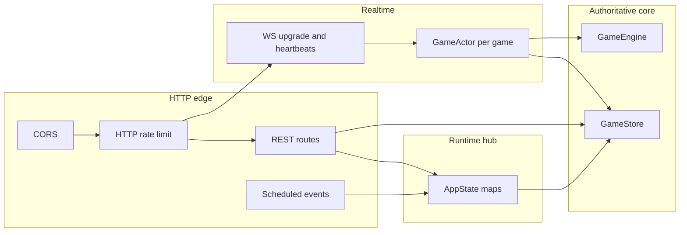

Key files under `backend/crates/judgement-server/src/`:

| Module | Role |
|--------|------|
| `routes.rs` | Guest, rooms, start, history, AI, coach |
| `events.rs` | Scheduled meetups, RSVP, open-lobby, ICS |
| `ws.rs` | Auth, token rotate, ping/liveness, enqueue commands |
| `actor.rs` | Sequential apply → persist → broadcast |
| `state.rs` | Sessions, rooms, games, tokens, store handle |
| `persist.rs` / `restore.rs` | Runtime ↔ store mapping; boot restore |
| `emotes.rs` | Allow-lists and text→emoji lexicon |
| `audio.rs` | Soundboard allow-list + voice-note size/mime caps |
| `cors.rs` / `http_limit.rs` | Origins and abuse controls |

### 2.3 Frontend layers

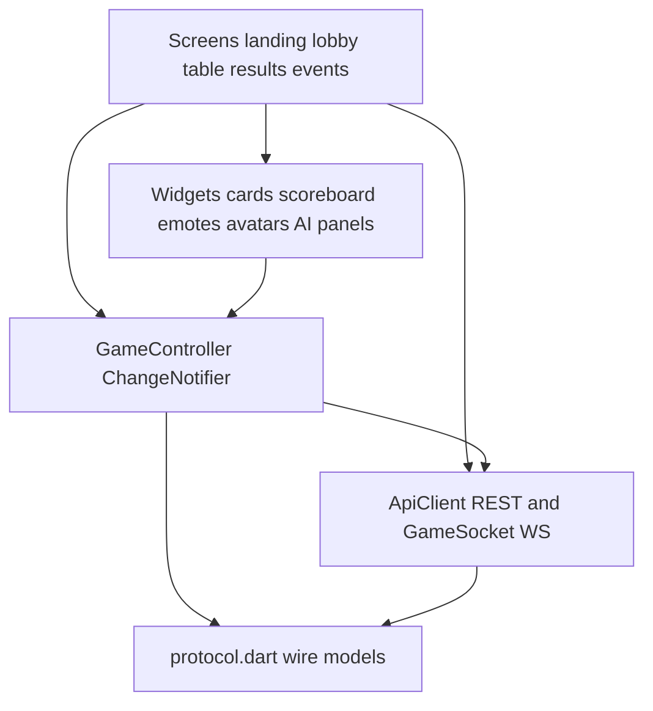

Root: `frontend/judgement_flutter/lib/`

| Layer | Path | Role |
|-------|------|------|
| Entry / theme / deep links | `main.dart`, `app/app.dart` | Material shell; `/e/{slug}`, `/r/{CODE}` routing |
| Screens | `screens/` | Landing → lobby → table → results; event flows |
| State | `state/game_controller.dart` | Snapshot mirror + command lifecycle |
| Networking | `networking/api_client.dart`, `game_socket.dart` | REST + WSS |
| Models | `models/protocol.dart` | Dart mirror of `judgement-protocol` |
| Widgets / util | `widgets/`, `util/` | UI and cosmetic packs |

State management: `ChangeNotifier` + `ListenableBuilder` (no Riverpod).

---

## 3. Production topology and config

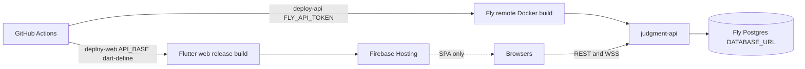

| Variable | Where | Purpose |
|----------|-------|---------|
| `API_BASE` | Flutter `--dart-define` / GH variable | REST base; WS scheme derived (`http`→`ws`) |
| `ALLOWED_ORIGINS` | Fly secret | CORS allow-list (unset = permissive **dev only**) |
| `PUBLIC_WEB_ORIGIN` | Fly secret + GH variable | Invite / WhatsApp / ICS absolute links |
| `DATABASE_URL` | Fly secret (attach) | Postgres; unset → in-memory store |
| `JUDGEMENT_ALLOW_SEED` | Env (non-prod) | Allow deterministic `seed` on start |
| `RAG_ENABLED` | Fly secret | Optional RAG path |

See [`docs/runbooks/deploy.md`](runbooks/deploy.md) and [`deployment/fly.env.example`](../deployment/fly.env.example).

---

## 4. Interfaces

### 4.1 REST vs WebSocket split

| Transport | Use |
|-----------|-----|
| **REST** | Guest session, rooms/lobby (incl. host remove-player before start), avatar (lobby), scheduled events, AI rules query, coach/highlights, history |
| **WebSocket** | Live bids/plays, snapshots, presence, timers, pause/resume, bot takeover, in-game avatar, table emotes, soundboard, short voice notes |

Lobby freshness uses **HTTP polling** (~2s). Live play uses **full personalized snapshots** after each accepted mutation (no client-side deltas).

### 4.2 Major REST surface

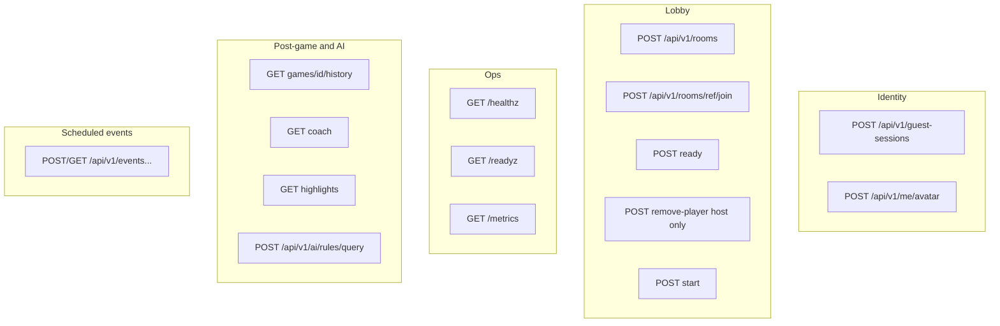

Authoritative router: `backend/crates/judgement-server/src/lib.rs`.

### 4.3 WebSocket contract

**Endpoint:** `GET /api/v1/games/{game_id}/ws?token={bearer}`

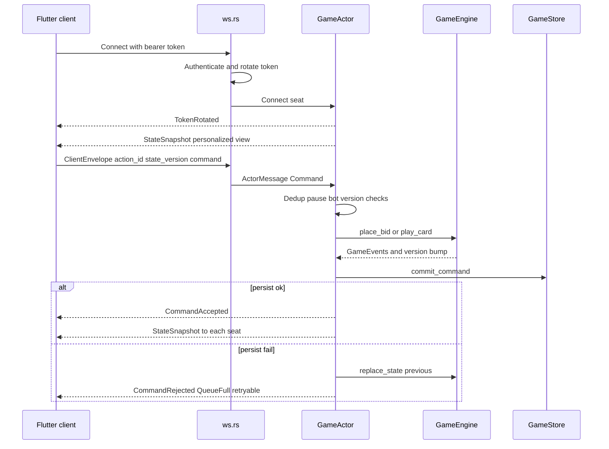

**Client envelope fields:** `protocol_version`, `action_id` (UUID, idempotent), `game_id`, `expected_state_version`, `action`.

**Server messages (selected):** `CommandAccepted` / `CommandRejected`, `StateSnapshot`, presence, `GamePaused` / `GameResumed`, `BotTookOver` / `PlayerResumedControl`, `TokenRotated`, `TimerUpdated`, `TableEvent` (emotes / soundboard), `VoiceNote` (ephemeral Opus ≤6s, not persisted).

Hardening: max message 64 KiB; ping 15s; liveness 45s; command queue capacity 256.

---

## 5. End-to-end product flows

### 5.1 Guest → lobby → game → results

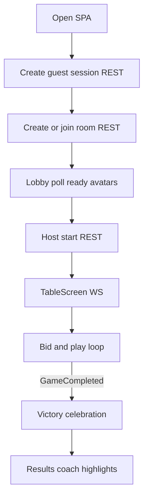

### 5.2 One accepted bid or play (data path)

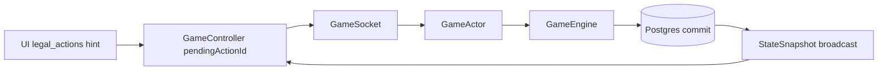

Client uses `legal_actions` only to enable UI; rejects and scores always come from the server.

### 5.3 Scheduled event path

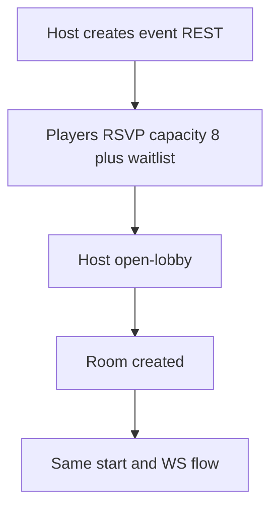

Deep links: `/e/{slug}` invite, `/e/{slug}/manage?token=` manage, `/r/{CODE}` room join (Firebase SPA rewrite). ADR: [`0005-scheduled-game-events.md`](adr/0005-scheduled-game-events.md).

### 5.4 Presence, pause, bot takeover

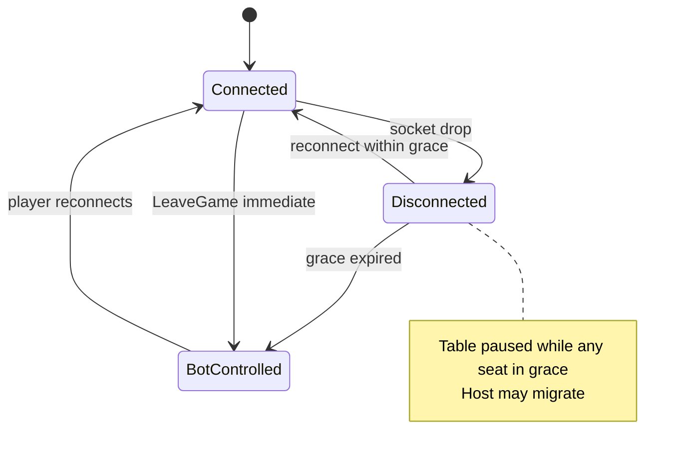

ADR: [`0004-presence-grace-bot-takeover.md`](adr/0004-presence-grace-bot-takeover.md). Defaults: reconnect grace ~60s; optional turn timer from room options (ADR [`0003`](adr/0003-table-size-timer-trump-options.md)).

Every successful WS upgrade **rotates** the bearer token (`TokenRotated`); old token invalidated.

### 5.5 Actor-per-game concurrency model

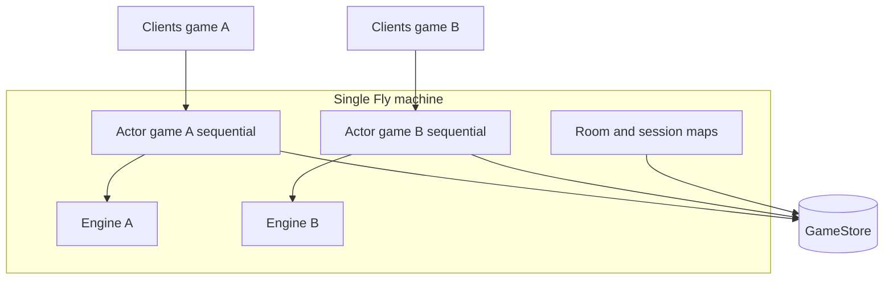

ADR: [`0001-actor-per-game.md`](adr/0001-actor-per-game.md). One sequential tokio task per active game avoids locks inside the engine.

**CAP stance:** the realtime path is **CP** — one writer per `game_id`, durable tip before clients see accepts. Availability is improved by pool headroom, product capacity gates (busy notice at 25 tables; `CAPACITY_FULL` at 35 tables or 200 WS), emergency `MAX_ACTIVE_GAMES` (100), client auto-resend on `PersistUnavailable`, actor respawn from tip, and outbound snapshot dirty-resync — not by multi-writer AP. Horizontal scale beyond one Fly machine needs game ownership leases + sticky routing (deferred; see `docs/game_estimation.md` cost ladder). Keep API and Postgres colocated in the same region.

---

## 6. Domain game loop

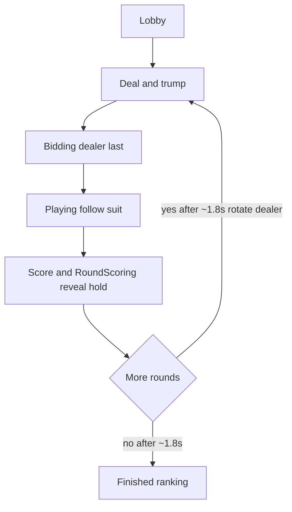

Rules reference: [`docs/RULES.md`](RULES.md). Optional dealer total restriction is **off by default** (host toggle at room create).

Projection: `PlayerGameView` exposes own hand + legal actions; opponents see `card_count` only — never hidden cards.

---

## 7. Data model and durability

### 7.1 Durable vs runtime-only

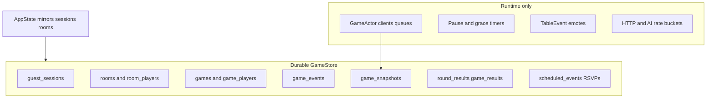

**Commit rule:** mutate engine → `commit_command` → on failure `replace_state(previous)` so clients never observe undurable authoritative state.

### 7.2 Persistence migrations

| Migration | Purpose |
|-----------|---------|
| `0001_init` | Sessions, rooms, games, events, snapshots, results |
| `0002` | Round schedule on rooms |
| `0003` | Scheduled events + RSVPs |
| `0004` | Min players 3 |
| `0005` | Waitlist status |
| `0006` | Avatars |
| `0007` | Dealer total restriction column |

Path: `backend/crates/judgement-persistence/migrations/`. Boot: `JUDGEMENT_MIGRATIONS_DIR` (Fly sets `/srv/migrations/persistence`).

### 7.3 Restore on boot

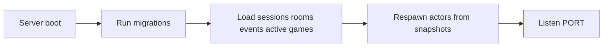

`DATABASE_URL` unset → `MemoryStore` (dev; lost on restart).

---

## 8. Communication summary

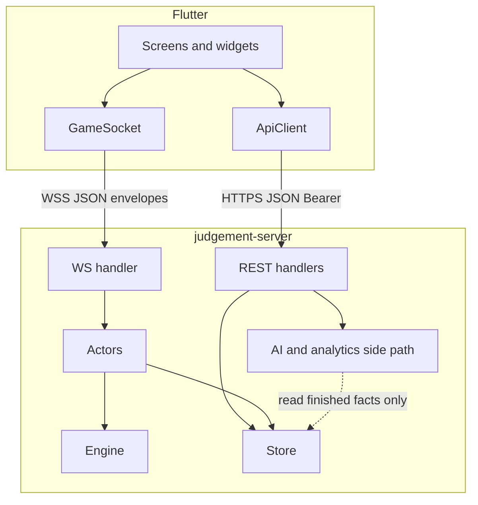

| Channel | Format | Auth |
|---------|--------|------|
| REST | JSON | `Authorization: Bearer {token}` |
| WS | JSON envelopes | Query `?token=` then rotated token on wire |
| Emotes | WS `TableEvent` | Ephemeral; not persisted as engine events |
| Soundboard | WS `TableEvent` kind `soundboard` | Asset id only; clients play local `assets/sounds/`; 10s audio cooldown |
| Voice notes | WS `VoiceNote` | Short Opus/WebM base64 ≤40KB / ≤6s; fan-out only; not stored; shared audio cooldown + client FIFO queue |
| Metrics | Prometheus text | Public `/metrics` |

---

## 9. AI and coaching boundary

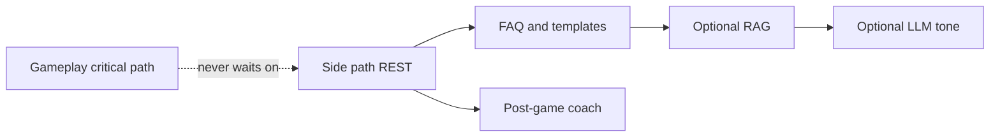

ADR: [`0002-rig-for-ai-and-rag.md`](adr/0002-rig-for-ai-and-rag.md).

- AI never mutates engine state and must not receive hidden hands or shuffle seeds.
- Coach/highlights run only for finished games from durable scores.
- Bots (`judgement-bot`) are rule strategies, not LLM.

---

## 10. Frontend screen map

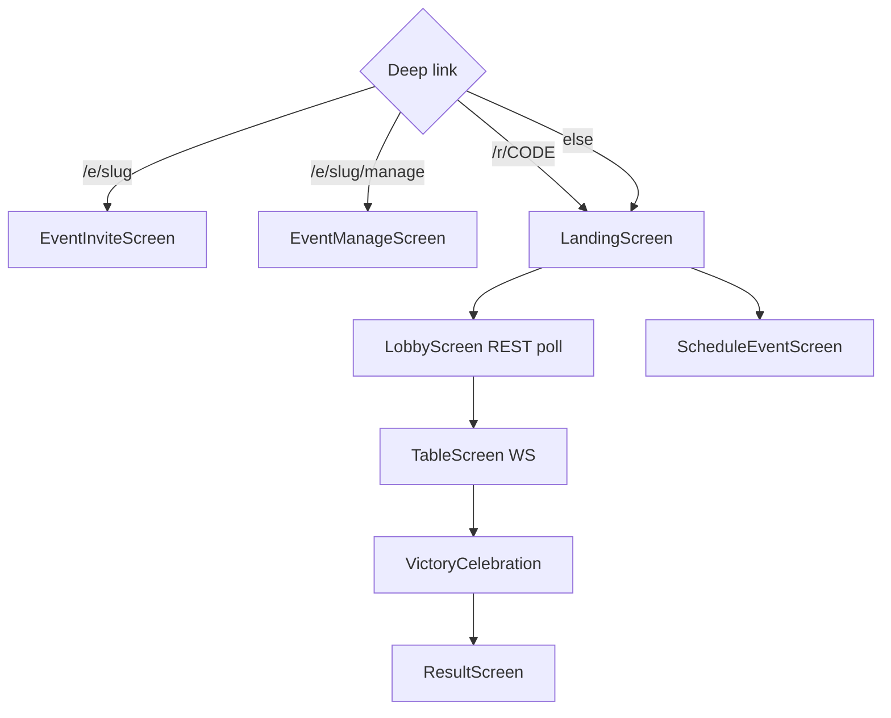

Cosmetic engagement (avatars, reactions, cartoon text blasts) is presentation-only; mid-game scoreboard shows round history without a Totals row until the game finishes.

---

## 11. Design decisions index (ADRs)

| ADR | Title | Impact |
|-----|-------|--------|
| [0001](adr/0001-actor-per-game.md) | Actor per game | Sequential commands; snapshot broadcast |
| [0002](adr/0002-rig-for-ai-and-rag.md) | Rig + RAG | AI off critical path |
| [0003](adr/0003-table-size-timer-trump-options.md) | Table options | 3–8 seats, timer, trump, schedules |
| [0004](adr/0004-presence-grace-bot-takeover.md) | Presence | Grace, bots, token rotation |
| [0005](adr/0005-scheduled-game-events.md) | Scheduled events | Meetup RSVP → lobby |

---

## 12. Repository map

```text
judgement/
├── backend/crates/          # Rust workspace (domain → engine → server)
├── frontend/judgement_flutter/  # Flutter Web client
├── docs/                    # Rules, ADRs, runbooks, this file
├── rules/                   # Curated rule text for FAQ/RAG
├── deployment/              # Docker, compose, env examples, scripts
├── fly.toml                 # Fly app config
└── .github/workflows/       # CI + Deploy
```

---

## 13. Related docs

- Product / engineering plan: [`PLAN.md`](../PLAN.md)
- Rules: [`RULES.md`](RULES.md)
- Deploy: [`runbooks/deploy.md`](runbooks/deploy.md)
- Security gate: [`SECURITY.md`](SECURITY.md)
- Frontend layout: [`frontend/judgement_flutter/README.md`](../frontend/judgement_flutter/README.md)
