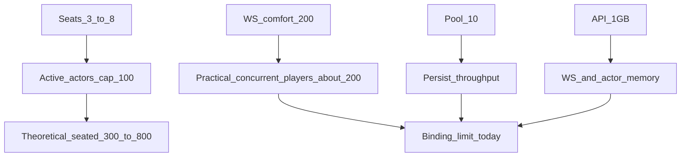

# Game capacity estimation

Ballpark capacity, latency, availability, and scalability numbers for Judgement
on the **current production topology**. Figures are engineering estimates from
code limits + deployment shape — **not** a measured multiplayer soak unless
labeled otherwise.

Related: [`LOAD.md`](LOAD.md), [`Architecture.md`](Architecture.md),
[`runbooks/incident.md`](runbooks/incident.md).

---

## 1. Executive summary

| Metric | Ballpark (current prod) |
|--------|-------------------------|
| Product **comfort** band | **0–24** active tables (normal UX) |
| Product **busy** band | **25–34** tables — create OK with notice |
| Product **hard** gate | **≥35** tables **or** **≥200** WS — reject new create/start (`CAPACITY_FULL`) |
| Emergency code cap | **100** (`MAX_ACTIVE_GAMES`) — ops backstop only |
| Healthy concurrent tables (6-seat) | **~25–40** |
| Practical concurrent connected players | **~200** (LOAD WebSocket target) |
| Comfortable India/UAE mix | **~120–180** players on **~20–30** tables |
| Concurrent lobbies (not started) | Practical; gated by product hard when actors/WS full |
| Bid/play perceived latency (healthy DB) | India **~100–200ms** p50; UAE **~150–250ms** p50 |
| Persist p95 target | **&lt; 50ms** |
| Availability class | Single-node **CP**; ~**99.0–99.5%** class if Fly/DB healthy (not a contract) |
| Binding limit today | **WebSocket / API memory (~200)** — product hard gate matches this |
| Cheapest scale-up | API **1GB → 2GB** (~+$5/mo), then raise hard gate — **not** a 2nd API writer yet |

---

## 2. Baseline assumptions

| Resource | Current value | Source |
|----------|---------------|--------|
| Region | Fly `sin` (API + Postgres colocated) | `fly.toml`, deploy runbook |
| API VM | 1× shared CPU, **1GB** RAM | `fly.toml` / `fly scale` |
| Postgres | ~**2GB** performance RAM, **1GB** volume | ops |
| sqlx pool | **max_connections = 10** | `judgement-persistence` `PostgresStore::connect` |
| In-game start cap | **`MAX_ACTIVE_GAMES = 100`** | `routes.rs` |
| Seats per table | **3–8** | `judgement-domain` `MIN_PLAYERS` / `MAX_PLAYERS` |
| Actor command queue | **256** / game | `actor.rs` `COMMAND_QUEUE_CAPACITY` |
| WS client buffer | **64** messages | `actor.rs` `CLIENT_BUFFER_CAPACITY` |
| Persist timeout | **3s** (up to 2 attempts) | `actor.rs` `PERSIST_TIMEOUT` |
| HTTP rate limit | **120**/min general; **20**/min guest-session | `http_limit.rs` defaults |
| LOAD aspirational WS | **200** concurrent | `LOAD.md` |
| LOAD persist / command p95 | **&lt;50ms** / **&lt;100ms** | `LOAD.md` |

---

## 3. Capacity model

### Hard / soft limits

| Limit | Value | Effect |
|-------|-------|--------|
| Product hard gate | 35 actors or 200 WS | New create/start/restart → `CAPACITY_FULL` (503); live games untouched |
| `MAX_ACTIVE_GAMES` | 100 | Emergency shed only (raw conflict) |
| Seats / table | 3–8 | Cap seated if all 100 tables full: **800**; at 6p: **600** |
| LOAD WS target | 200 | Practical concurrent connected players before comfort/OOM risk |
| sqlx pool | 10 | At most ~10 concurrent DB commits; contention under load |
| Actor queue | 256 / game | Overflow → retryable `QueueFull` |
| Lobby rooms | no start-cap | Many lobbies OK until RAM / HTTP rate limits hurt |

### Headline estimates

| Scenario | Estimate | Notes |
|----------|----------|--------|
| **Lobby rooms** created at once | Practical **~50–150** | Order-of-magnitude; not soak-tested. Rate-limited guest creates (20/min/IP-ish window) slow stampede. |
| **In-game tables** at once | Soft max **100**; healthy **~25–40** (6-seat) | Healthy band keeps WS near LOAD target. |
| **Players in-game (theoretical)** | **300–800** | Pure seats × actors; ignores WS/memory. |
| **Players concurrent (practical)** | **~200** | Matches LOAD WebSocket target. |
| **Comfortable India/UAE mix** | **~120–180** on **20–30** tables | Leaves headroom for reconnects, lobbies, spikes. |

**Important tension:** the code allows **100** started games, but the documented WS comfort is **~200** connections. Filling the start cap at 6 seats would imply **~600** sockets — likely to stress the **1GB** API before Postgres is the limiter. Treat **100** as a shed-load ceiling, not a promise of 100 healthy full tables.

---

## 4. Latency budget

End-to-end for a bid or card play (healthy path):

| Segment | Ballpark |
|---------|----------|
| Client ↔ Fly `sin` RTT | India **~50–90ms**; UAE **~70–120ms** |
| Actor validate + apply | **&lt;1–5ms** typical |
| Persist commit | Target p95 **&lt;50ms**; hard timeout **3s**/attempt |
| Snapshot fanout (≤8 seats) | Usually small vs RTT |
| **Perceived action latency** | India **~100–200ms** p50; UAE **~150–250ms** p50 |

Under DB pressure:

- Actor awaits persist → table feels frozen.
- Client shows “Saving…” and auto-resends same `action_id`.
- Worst case approaches multi-second (timeout × retries) before reject/recover.

**Emotes / emoji blasters:** WebSocket only, **not** persisted → typically **RTT + a few ms**; rate-limited (~2s cooldown per seat).

Metric to watch: `judgement_persist_commit_duration_milliseconds_*` on `/metrics`.

---

## 5. Availability (numbers + class)

| Aspect | Estimate / behavior |
|--------|---------------------|
| Topology | **One** API machine (`min_machines_running = 1`) |
| CAP class | **CP** for table authority (durable tip before clients see accepts) |
| Process death | All WS drop; tip snapshots restore actors on boot; players reconnect |
| Actor crash | Reaper attempts **respawn from tip** for still-active games |
| Presence | ~**60s** reconnect grace → vacant seat → claim or host/timeout end |
| Monthly availability class | **~99.0–99.5%** if Fly + Postgres stay healthy — **not** an SLO contract; no multi-AZ active-active API |

Availability levers already in place: pool sizing, start admission, persist uncertainty check, client auto-retry, actor respawn, outbound dirty resync. These improve recovery; they do **not** remove the single-machine SPOF.

---

## 6. Scalability

### What scales today

- **Across tables:** one sequential Tokio actor per `game_id` (no lock across games).
- **Within a table:** one command at a time (by design for Consistency).

### What does not scale today

- **Horizontal API:** no sticky routing / game ownership lease — unsafe to run 2+ writers.
- **Shared pool:** all tables compete for 10 DB connections.
- **API RAM / WS count:** single 1GB process.

### Throughput sketch (orders of magnitude)

| Assumption | Calc |
|------------|------|
| Persist 20–50ms, pool 10 | Theoretical shared **~200–500 commits/s** |
| 30 tables × ~0.3 actions/s | **~9 commits/s** → large headroom if DB stays fast |
| 100 tables × ~0.3 actions/s | **~30 commits/s** — still fine for pool math; **WS/memory** fails first |

### Cost-first scale ladder (ops)

| Step | When | Extra cost (ballpark) | Notes |
|------|------|----------------------|--------|
| Product hard @ 35 / 200 WS | Always (shipped) | $0 | Protects in-progress players |
| API **1GB → 2GB** shared | Full rejects frequent; persist OK | **~+$5/mo** | Then raise hard to ~50 / ~300 WS |
| Postgres RAM bump | Persist p95 / write failures under &lt;30 tables | **~+$10–20/mo** | Measure first; does not fix WS |
| Second API machine | Only after **ownership leases + sticky WS** | **~+$6/mo** + eng | Unsafe today — deferred Phase B |

Do **not** move DB alone to another cloud/region — adds persist RTT and hurts Availability.
Do **not** autoscale API machine count without leases (split-brain).

---

## 7. Worked examples

| Mix | Tables | Seats/table | Connected players | Verdict vs current prod |
|-----|--------|-------------|-------------------|-------------------------|
| Small party night | 10 | 6 | 60 | Comfortable |
| Busy evening | 30 | 6 | 180 | Near LOAD target; primary operating band |
| Cap stress | 100 | 6 | 600 | **Above** WS comfort — expect API memory / latency pain even though start is allowed |
| Max seats theoretical | 100 | 8 | 800 | Code admits start; **not** a supported concurrent WS load |
| Lobby heavy | 80 lobbies + 20 games | — | ~120 in-game + lobby REST | Lobbies cheaper than WS; still watch RAM |

---

## 8. How to validate

1. Scrape `https://judgment-api.fly.dev/metrics` (or `./deployment/load/scrape_metrics.sh`):
   - `judgement_active_game_actors`
   - `judgement_active_websockets`
   - `judgement_persist_commit_duration_milliseconds_*`
   - `judgement_db_write_failures_total`
   - `judgement_games_admission_rejected_total`
   - `judgement_actors_respawned_total`
2. HTTP smoke: [`deployment/load/smoke.sh`](../deployment/load/smoke.sh) ([`LOAD.md`](LOAD.md)).
3. k6 ladder: [`deployment/load/run.sh`](../deployment/load/run.sh) — `smoke_ws` → `comfort` → `target` → `stress` (ephemeral/laptop). Soft product limit ≈ last green step (~30×6). Details: [`runbooks/load_testing.md`](runbooks/load_testing.md).
4. CI: every push runs ephemeral `smoke_ws`; nightly runs `comfort`; manual `load-prod-smoke` hits Fly with 1×6 only.
5. Incident thresholds: [`runbooks/incident.md`](runbooks/incident.md).

---

## 9. Disclaimer

- Numbers mix **hard code caps**, **documented LOAD targets**, and **order-of-magnitude** network/ops judgment.
- India/UAE RTT bands vary by ISP and path; measure from real clients when tuning UX.
- Filling `MAX_ACTIVE_GAMES` is not the same as supporting that many healthy full tables.
- Availability percentages are **class estimates** for a single Fly app + Postgres, not a contractual SLO.
